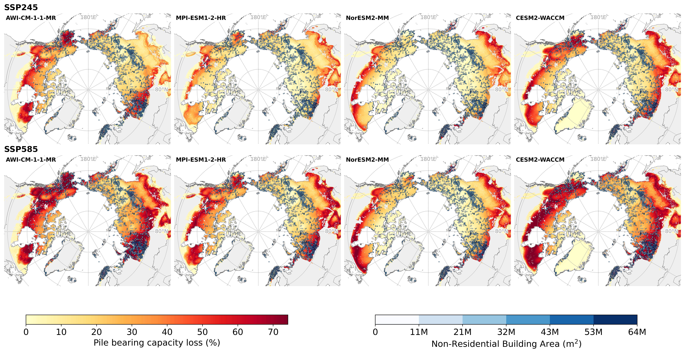

# Arctic Circumpolar Permafrost Degradation Impacts

The estimated cost of building damage caused by projected permafrost degradation has been largely underestimated.
Why? The answer is simple:\
Our understanding of climate risk is only as good as our understanding of our exposure to hazards. 
The better we can account for what is at risk, the better we can measure risk in a changing world. Previous studies
relied on geospatial building data that only measured the two-dimensional area of buildings. However, the cost of
replacing a totaled (i.e., damaged beyond repair) building depends on the total floor space, not just the footprint
area.\
After detecting buildings from satellite imagery, classifying their occupancy, and estimating the total floor space
of residential buildings, projected building damage based on a geotechnical model amounts to **76 B USD under SSP2‐4.5
and 261 B USD under SSP5‐8.5**.\
See the methods used to map the building stock below.

---

## Residential Building Damages

The figure below shows the estimated residential building volume across Arctic permafrost regions.

{width=100%}

{width=100%}

---

## Non-Residential Building Damages

Estimated non-residential building volume used for infrastructure damage assessment.

{width=100%}

{width=100%}

---

# Mapping the Arctic Circumpolar Building Stock

## Building detection
{width=100%}

## Building occupancy classification
{width=100%}

## Residential building volume estimation
{width=100%}