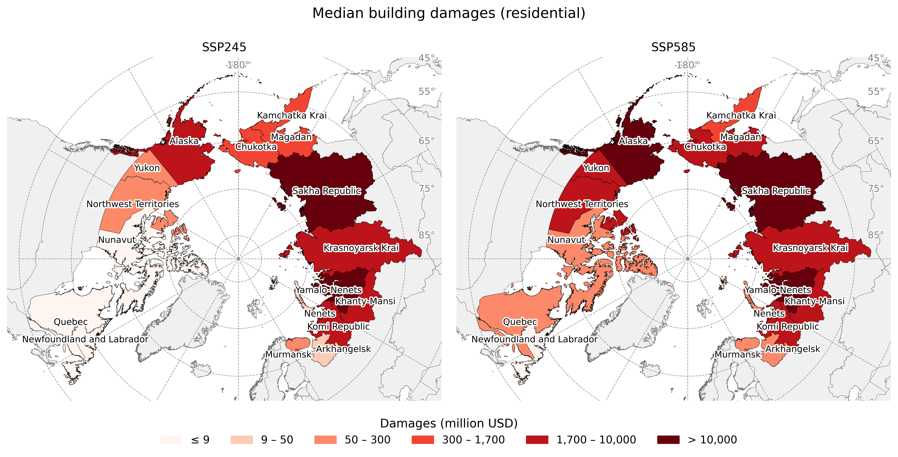
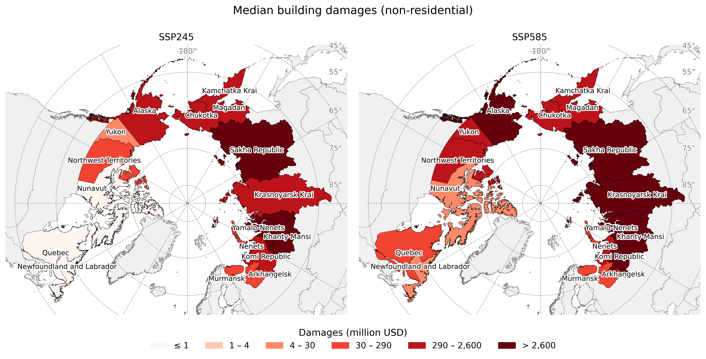

---

# Permafrost Infrastructure Risk

## Overview

This project develops a high-resolution Arctic building inventory and combines it with geotechnical permafrost models to estimate mid-century infrastructure damages across Alaska, Canada, and Russia.

---

## Residential Building Volume

{width=100%}

*Estimated residential building volume across the Arctic.*

---

## Non-Residential Building Volume

{width=100%}

*Estimated non-residential building volume across the Arctic.*

---

## Projected Residential Damages

{width=100%}

*Projected mid-century residential infrastructure damages under a median climate scenario.*

---

## Projected Non-Residential Damages

{width=100%}

*Projected mid-century non-residential infrastructure damages under a median climate scenario.*